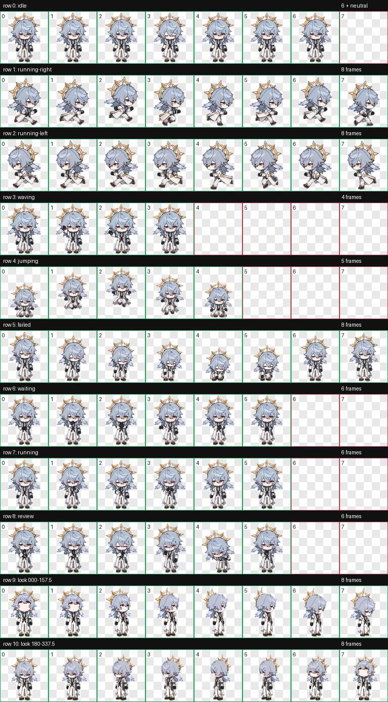

# 星期日 Pet

> 把匹诺康尼的晨光，留在桌面的一角。

他不再站在高台上宣判秩序，而是化作一只会呼吸、奔跑、等待、审阅，并循着你的指针抬眼望来的小小星期日。



## 它会做什么

- 9 组标准动画：待机、向左右奔跑、挥手、跳跃、失败、等待、工作与审阅。
- 桌面 v2 版包含 16 个注视方向：目光会随着指针自然转动。
- 保留角色辨识度：淡蓝长发、金色光环、耳翼，以及白、深蓝与金色礼服。
- Q 版贴纸风格：柔和、干净，适合长期停留在桌面。

## 安装

### ChatGPT 网页版

直接上传：

```text
spritesheet-web-8x9.webp
```

这是网页上传专用的 8×9 版本：透明 WebP、1536 × 1872、约 1.8 MiB，仅包含 9 组标准动画。

### Codex 桌面 v2

将本目录复制为：

```text
~/.codex/pets/sunday/
```

保持下面两个运行文件位于同一目录：

```text
pet.json
spritesheet.webp
```

`preview.png` 只是动作预览，不参与运行。网页版文件也不应替换桌面 v2 的 `spritesheet.webp`。

## 版本说明

| 文件 | 版本与用途 | 尺寸 | 内容 |
| --- | --- | --- | --- |
| `spritesheet.webp` | Codex Desktop v2 | 1536 × 2288（8×11） | 9 组标准动画 + 16 个注视方向 |
| `spritesheet-web-8x9.webp` | ChatGPT Web upload | 1536 × 1872（8×9） | 9 组标准动画，不含注视方向 |
| `preview.png` | 展示预览 | 非运行文件 | 动作联系表 |

## 技术规格

- Codex Desktop manifest：`spriteVersionNumber: 2`
- 桌面 v2 精灵图：1536 × 2288 WebP，透明背景
- 网页上传精灵图：1536 × 1872 WebP，透明背景，不超过 20 MiB
- 单格尺寸：192 × 208
- 布局：桌面 v2 为 8×11，网页上传版为 8×9
- 动画行：完整覆盖 9 种标准状态

## 声明

这是非官方、非商业的同人宠物。《崩坏：星穹铁道》及角色“星期日”的相关权利归 miHoYo / HoYoverse 及其权利方所有。
